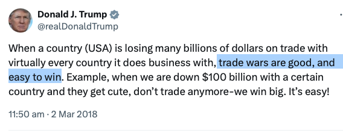
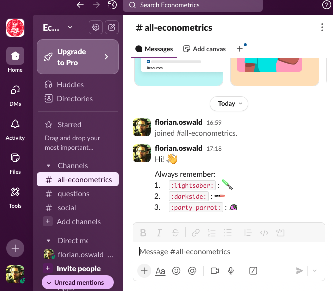

layout: true

<div class="my-footer"></div> 

---

```{r setup, include = FALSE, warning = FALSE, message = FALSE}
options(htmltools.dir.version = FALSE)
knitr::opts_chunk$set(
  message = FALSE,
  warning = FALSE,
  dev = "svg",
  cache = TRUE,
  fig.align = "center"
  #fig.width = 11,
  #fig.height = 5
)

# Load packages
library(tidyverse)
library(pander)
library(ggthemes)
library(gapminder)
library(countdown)
library(xaringanExtra)

# countdown style
countdown(
  color_border              = "#d90502",
  color_text                = "black",
  color_running_background  = "#d90502",
  color_running_text        = "white",
  color_finished_background = "white",
  color_finished_text       = "#d90502",
  color_finished_border     = "#d90502"
)
```


# Welcome to Econometrics @ ESOMAS UniTo!


## Team

.pull-left[

* My name is Florian Oswald, I'm a Professor at ESOMAS. Check out my [website](https://floswald.github.io)!

* I work on urban, macro and IO topics.
    
* Our TA this year is [Kacper Krasowski](https://kacperkrasowski.github.io), PhD student at Collegio Carlo Alberto.

]

--

.pull-right[
    
* I do a lot of computation (who doesn't). I like `R`, `python` and [`julia`](https://julialang.org) - I teach computational econ to our PhD students.

* I profited *a lot* from the open source software (OSS) community
* OSS is key to reproducible research. 

👉 seeing that every day as [Data Editor](https://jpedataeditor.github.io)

* I try to use and teach my students tools which enable greater reproducibility.

]


---

# Welcome to Econometrics @ ESOMAS UniTo!


- In this course you will learn the core tools of ***econometrics***.
 
--

- You will also learn to use the `R` programming language!

--

## What is *econometrics*?

- A set of ***techniques and methods*** to answer (economic) questions with ***data***.

- Some examples!

---

# Answering Important Questions with Econometrics

<!-- -- -->

<!-- [<ru-blockquote> -->
<!-- Does refugee migration *impact* Electoral Outcomes? -->
<!-- </ru-blockquote>](https://academic.oup.com/restud/article-abstract/86/5/2035/5112970) -->

--

[<ru-blockquote>
Does raising the minimum wage *reduce* employment for the low-skilled?
</ru-blockquote>](http://davidcard.berkeley.edu/papers/njmin-aer.pdf)

--

[<ru-blockquote>
Does mandating a 40% representation of each gender on the board of public limited liability companies increase the number of women in top jobs?
</ru-blockquote>](https://academic.oup.com/restud/article-abstract/86/1/191/5042274)

--

[<ru-blockquote>
Does the neighborhood you grew up in have an *impact* on your life outcomes?
</ru-blockquote>](https://academic.oup.com/qje/article/133/3/1107/4850660)

--

[<ru-blockquote>
Does giving a work permit to immigrants *cause* them to commit less crimes?
</ru-blockquote>](https://www.aeaweb.org/articles?id=10.1257/aer.20150355)


---

# Causality

* Notice that ***many other factors could have caused*** each of the outcomes mentioned.

--

* Often, we'll want to focus on the ***causal impact*** of just one of these factors (immigration, minimum wage, education ,etc.)

--

* Econometrics is about spelling out ***conditions*** under which we can ***claim to measure causal relationships***.

* We will encounter the most basic of those conditions, and talk about some potential pitfalls.

* ["Credibility Revolution"](https://www.aeaweb.org/articles?id=10.1257/jep.24.2.3) in econometrics over the past 30 years ([2022 Economics Nobel](https://www.nobelprize.org/prizes/economic-sciences/2021/press-release/) awarded to some of the main protagonists of this "revolution")

???

test comment speaker note.

---

# Welcome to the Post-Truth Age - Bullshit Rules the World

.pull-left[

- "Alternative facts" [Kellyanne Conway, Meet the Press, January 22, 2017]


]

.pull-right[


]


---

# Welcome to the Post-Truth Age - Bullshit Rules the World

.pull-left[

- "Alternative facts" [Kellyanne Conway, Meet the Press, January 22, 2017]

- "Trade wars are good and easy to win" [Donald Trump, 2018]


]

.pull-right[



]

---

# Welcome to the Post-Truth Age - Bullshit Rules the World

.pull-left[

- "Alternative facts" [Kellyanne Conway, Meet the Press, January 22, 2017]

- "Trade wars are good and easy to win" [Donald Trump, 2018]

- "The concept of global warming was created by and for the Chinese" [Donald Trump, Twitter, 2012]

]

.pull-right[


]


---

# Welcome to the Post-Truth Age - Bullshit Rules the World

.pull-left[

- "Alternative facts" [Kellyanne Conway, Meet the Press, January 22, 2017]

- "Trade wars are good and easy to win" [Donald Trump, 2018]

- "The concept of global warming was created by and for the Chinese" [Donald Trump, Twitter, 2012]

- Brexit: "We send the EU £350 million a week" [Vote Leave campaign bus, 2016]

]

.pull-right[


]

---

# Welcome to the Post-Truth Age - Bullshit Rules the World

.pull-left[

- "Alternative facts" [Kellyanne Conway, Meet the Press, January 22, 2017]

- "Trade wars are good and easy to win" [Donald Trump, 2018]

- "The concept of global warming was created by and for the Chinese" [Donald Trump, Twitter, 2012]

- Brexit: "We send the EU £350 million a week" [Vote Leave campaign bus, 2016]

]

.pull-right[

[<ru-blockquote>The law of Brandolini.</ru-blockquote>](https://en.wikipedia.org/wiki/Brandolini%27s_law)

]

---


# The Motto Of the USA (and This Course)


---


# The Motto Of the USA (and This Course)


---


# The Motto Of the USA (and This Course)


## "In God We Trust, All Others Must Bring Data"
*—W. Edwards Deming (attribution uncertain, often credited to him)*


---


# This Course

- Teach you the basics of ***linear regression***, ***statistical inference*** and ***impact evaluation***.

--

- Equip you with a framework to think more deeply about ***causality***.

--

- Introduce you to the `R` software environment.

--

- ⚠️ This is *not* a course about `R`.

--

**Grading. Two Options:**

.pull-left[
The **Good** Way:
* come to class
* take 5(?) quizzes on moodle during the semester (0% of grade).
* take closed book exam (100%) early December 2025.

]

--

.pull-right[

The **Other** Way

* (come to class?)
* take closed book exam (100%) later.
* (do worse on the exam.)

]

---

# Communication: Slack

.pull-left[

Questions like 

* *I don't understand x*
* *y does not work for me*
* *when is the exam*
* *can I come to office hours?"*

will *only* be answered on Slack.

All other questions via email to

`florian.oswald@unito.it` or
`kacper.krasowski@carloalberto.org`

What is *Slack*??


]

--

.pull-right[

]

---

# Your To-Do List for Tomorrow

1. Sign up on moodle: [https://elearning.unito.it/sme/course/view.php?id=8568](https://elearning.unito.it/sme/course/view.php?id=8568)

2. From moodle, sign up on slack

3. Update your laptop OS and install `R`: [https://cloud.r-project.org](https://cloud.r-project.org)

4. Install `RStudio` at [https://posit.co/download/rstudio-desktop/](https://posit.co/download/rstudio-desktop/)


---

# Class Conduct and My Expectations 🧐

--

1. Come to class: You will understand better.

--

2. Be on time, be polite, don't use your phone. `#respect #reciprocity`

--

3. Open/Close your laptop when I say so. (take notes on paper)

--

4. Ask questions ***any time*** by raising your hand.

--

5. Work in groups: You can/should work in groups of 2-3 on the quizzes.

--

6. Don't cheat in exam. No phones. Penalties are severe.


---

layout: false
class: title-slide-section-red, middle

# Notation in Slides

---

layout: true

<div class="my-footer"></div> 

---


# Notation is Important

1. Simple Text

2. ***Important*** text is in italic red. **Very Important** text is in boldface red.

3. Maths looks like this: $\int f(x) dx$

4. `R` Code inline has pink background: `data(gapminder, package = "dslabs")`


---

class: inverse

# Notation is Important

1. Simple Text

2. ***Important*** text is in italic red. **Very Important** text is in boldface red.

3. Maths looks like this: $\int f(x) dx$

4. `R` Code inline has pink background: `data(gapminder, package = "dslabs")`

5. In-class tasks for you have a pink background. Do the tasks! 😉

---

layout: false
class: title-slide-section-red, middle

# R

---

layout: true

<div class="my-footer"></div> 

---

## What is `R`?

`R` is a __programming language__ with powerful statistical and graphic capabilities.

--

## Why are we using `R`?<sup>1</sup>

.footnote[
[1]: This list has been inspired by [Ed Rubin's](https://github.com/edrubin/EC421S19).  
<span style="visibility:hidden">[2]: Learning `R` definitely requires time and effort but it's worth it, trust me! .</span>
]

--

1. `R` is __free__ and __open source__—saving both you and the university 💰💵💰.

--

1. `R` is very __flexible and powerful__—adaptable to nearly any task, (data cleaning, data visualization, econometrics, spatial data analysis, machine learning, web scraping, etc.)

--

1. `R` has a vibrant, [thriving online community](https://stackoverflow.com/questions/tagged/r) that will (almost) always have a solution to your problem.

--

1. If you put in the work<sup>2</sup>, you will come away with a __very valuable and useful__ tool.

.footnote[
<span style="visibility:hidden">[1]: This list has been inspired by [Ed Rubin's](https://github.com/edrubin/EC421S19).</span>  
[2]: Learning `R` definitely requires time and effort but it's worth it, trust me! 
]

???

* Single user Stata/SE annual license costs 485 USD for education.
* Student lab for 25 students costs 4135 USD per year.

<!-- --- -->

<!-- # Why can't we just use Excel? -->

<!-- Many reasons but here are just a few: -->

<!-- -- -->

<!-- - Not ***reproducible***. -->

<!-- -- -->

<!-- - Not straightforward to ***merge*** datasets together. -->

<!-- -- -->

<!-- - Very fastidious to ***clean*** data. -->

<!-- -- -->

<!-- - Limited to ***small datasets***. -->

<!-- -- -->

<!-- - Not designed for proper ***econometric analyses***, maps, complex visualisations, etc. -->

---

layout: false
class: title-slide-section-red, middle

# First Taste of R 

---

layout: true

<div class="my-footer"></div>

---

# In Practice: Data Wrangling

--

* You will spend a lot of time preparing data for further analysis.

--

* The `gapminder` dataset contains data on life expectancy, GDP per capita and population by country between 1952 and 2007.

* Let's first discuss some basics, and then try to answer a simple question.

---

# Loading a Dataset


```{r gapminder, echo = T, eval = T}
# load gapminder package
library(gapminder)
# load the dataset from the gapminder package
data(gapminder, package = "gapminder") 
# show first 10 lines of this dataframe
head(gapminder,n = 10)
```


---

# What is a *Dataset*? 

## Cross Sectional Data

👉 **One index only:** `country`

.pull-left[
###  Cross Section of Countries in 1950
```{r,echo = FALSE}
gapminder %>% 
    filter(year == "1952") %>%
    select(-continent) %>%
    head(n = 10)
```
]

--

.pull-right[
###  Cross Section of Countries in 2007
```{r,echo = FALSE}
gapminder %>% 
    filter(year == "2007") %>%
    select(-continent) %>%
    head(n = 10)
```
]

---

# What is a *Dataset*? 

## Panel (or longitudinal) Data 👉 **two indices:** `country` and `year`

.pull-left[

```{r,echo = FALSE}
gapminder %>% 
    filter(year %% 2 == 0, country %in% c("Italy","Poland","India"))
```

]

--

.pull-right[

* Can you tell me what the definition of an `index` is in this context?

* Why is `year` and `continent` not a valid index?

* 🤔

]

---

# What is a *Dataset*? 

.pull-left[

### Italy
```{r}
gapminder %>% 
    filter(country == "Italy")
```
]

--

.pull-right[
### Poland
```{r}
gapminder %>% 
    filter(country == "Poland")
```
]


---

# In Practice: Data Wrangling


* Suppose we want to know the average life expectancy and average GDP per capita for each **continent** in each year.

--

* We need to group the data by continent *and* year, then compute the average life expectancy and average GDP per capita

--

* There are always several ways to achieve a goal. (As in life 😁)

* Here we will only focus on the `dplyr` way:

.pull-left[
```{r}
# compute the required statistics
# average life exp and gdp per cap
gapminder_dplyr = gapminder %>% 
  group_by(continent, year) %>% 
  summarise(count = n(),
            mean_lifeexp = mean(lifeExp),
            mean_gdppercap = mean(gdpPercap))
```

]

.pull-right[
```{r}
# show first 5 lines of this new dataset
head(gapminder_dplyr, n = 5)
```
]

---

# Visualisation

.pull-left[
* Now we could *look* at the result in `gapminder_dplyr`, or compute some statistics from it. 

* Nothing beats a picture, though:

```{r gampminder_plot, eval = FALSE}
ggplot(data = gapminder_dplyr, 
       mapping = aes(x = mean_lifeexp,
                     y = mean_gdppercap,
                     color = continent,
                     size = count)) +
  geom_point(alpha = 1/2) +
  labs(x = "Average life expectancy",
       y = "Average GDP per capita",
       color = "Continent",
       size = "Nb of countries") +
  theme_bw()
```
]

--

.pull-right[
```{r gampminder_plot, echo = FALSE}
```
]

???

* We map different features of the data to different ways of representing it
* color
* size of point
* different scales for each

---

# Animated Plotting 👌 <sup>1</sup>

```{r, example: gganimate, include = F, cache = T}
# The package for animating ggplot2
library(gganimate)
# As before
# gg <- ggplot(
#   data = gapminder %>% filter(continent != "Oceania"),
#   aes(gdpPercap, lifeExp, size = pop, color = country)
# ) +
# geom_point(alpha = 0.7, show.legend = FALSE) +
# scale_colour_manual(values = country_colors) +
# scale_size(range = c(2, 12)) +
# scale_x_log10("GDP per capita", label = scales::comma) +
# facet_wrap(~continent) +
# theme_pander(base_size = 16) +
# theme(panel.border = element_rect(color = "grey90", fill = NA)) +
# # Here comes the gganimate-specific bits
# labs(title = "Year: {frame_time}") +
# ylab("Life Expectancy") +
# transition_time(year) +
# ease_aes("linear")
# # Save the animation
# anim_save(
#   animation = gg,
#   filename = "ex_gganimate.gif",
#   path = "chapter_in1les/figure-html",
#   width = 9,
#   height = 4,
#   units = "in",
#   res = 150,
#   nframes = 56
# )
```

.center[]

.footnote[
[1]: This animation is taken from [Ed Rubin](https://raw.githack.com/edrubin/EC421S19/master/LectureNotes/01Intro/01_intro.html#40).
]

---

layout: false
class: title-slide-section-red, middle

# R 101: Here Is Where You Start

---

layout: true

<div class="my-footer"></div> 

---

# Start your `RStudio`!

## First Glossary of Terms

* `R`: a programming language.

* `RStudio`: an integrated development environment (IDE) to work with `R`.

--

* *command*: user input (text or numbers) that `R` *understands*.

* *script*: a list of commands collected in a text file, each separated by a new line, to be run one after the other.

--

* To run a script, you need to highlight the relevant code lines and hit `Ctrl`+`Enter` (Windows) or `Cmd`+`Enter` (Mac).

---

# `RStudio` Layout

```{r, echo = F, out.width = "600px"}
knitr::include_graphics("chapter_intro_files/figure-html/rstudio.png")
```

---

# R as a Calculator

* You can use the `R` console like a calculator

* Just type an arithmetic operation after `>` and hit `Enter`!

--

* Some basic arithmetic first:
```{r}
4 + 1
8 / 2
```


* Great! What about this?
```{r}
2^3
# by the way: this is a comment! R therefore disregards it
```

---

class: inverse

# Task 1

```{r,echo = FALSE}
countdown(minutes = 5, top = 0)
```

1. Create a new R script (File $\rightarrow$ New File $\rightarrow$ R Script). Save it somewhere as `lecture_intro.R`.

1. Type the following code in your script and run it. To run the code press `Ctrl` or `Cmd` + `Enter` (you can either highlight the code or just put your cursor at the end of the line)
    ```{r, eval = F}
    4 * 8
    ```

1. Type the following code in your script and run it. What happens if you only run the first line of the code?
    ```{r, eval = F}
    x = 5 # equivalently x <- 5
    x
    ```
Congratulations, you have created your first `R` "object"! Everything is an object in R! Objects are assigned using `=` or `<-`.

1. Create a new object named `x_3` to which you assign the cube of `x`. Note that to assign you need to use `=` or `<-`. Use code to compute the cube, not a calculator.

---

# Where to get Help?

.pull-left[
`R` built-in `help`:
```{r, eval = FALSE}
?log #? in front of function
help(lm)   # help() is equivalent
??plot  # get all help on keyword "plot"
```
]

--

.pull-right[
In practice:

]

---

# Collaborate!


---

# R Packages

* `R` users contribute add-on data and functions as *packages*

* Installing packages is easy! Just use the `install.packages` function:
    ```{r, eval = FALSE}
    install.packages("ggplot2")
    ```

* To *use* the contents of a packge, we must load it from our library using `library`:
    ```{r, message = FALSE, warning = FALSE,eval=FALSE}
    library(ggplot2)
    ```

---

# Data *Types*. What kinds of **Data** are there actually?

--

👉 Numbers, text, categories, images, ...

--

Unfortunately, your (mine, everybody's) computer only "speaks" `0` and `1`. That's why software **encodes** different kinds of data differently:

<br>

| Data    | R Type                           | Binary Encoding |
|---------|----------------------------------|-----------------------------|
| `42`      | `r typeof(42)`                   | `101010` (integer in base-2)|
| `"A"`     | `r typeof("A")`                  | `01000001` (ASCII)          |
| `TRUE`    | `r typeof(TRUE)`                 | `1`                         |
| `FALSE`   | `r typeof(FALSE)`                | `0`                         |
| `factor("Male")`   | `r typeof(factor("Male"))`   | `00000001` |
| `factor("Female")` | `r typeof(factor("Female"))` | `00000010` |


---

# Vectors


.pull-left[
* The `c` function creates vectors, i.e. *one-dimensional arrays*.
    ```{r}
    c(1, 3, 5, 7, 8, 9)
    ```
    
* Coercion to unique types:
    ```{r}
    (v <- c(42, "Statistics", TRUE))
    ```
]

--

.pull-right[

* Creating a *range*
    ```{r}
    1:10
    ```

* get vector elements with square bracket operator `[index]`:
    ```{r}
    v[c(1,3)]
    ```
]

---

# `data.frame`'s

`data.frame`s represent **tabular data**. Like spreadsheets.

```{r}
example_data = data.frame(x = c(1, 3, 5, 7),
                          y = c(rep("Hello", 3), "Goodbye"),
                          z = c("one", 2, "three", 4))
example_data
```

* A `data.frame` has 2 dimensions: *rows* and *columns*. Like a *matrix*. Can get elements with `[row_index,col_index]`.

* In practice, you will be importing files that contain the data into `R` rather than creating `data.frame`s by hand.


---

layout: false
class: title-slide-section-red, middle

# Go to https://tinyurl.com/metrics-task2 

### You need some real data for the next task.

---

layout: true

<div class="my-footer"></div> 


---

class: inverse

# Task 2

`r countdown(minutes = 7, top = 0)`

```{r, echo=F}
murders <- read.csv("https://www.dropbox.com/scl/fi/uq8xlecjczy2t2vu50h7l/gun_murders.csv?rlkey=4zr1t5o7jsi9pgoey4tep467w&dl=1")
```

1. Find out (using `help()` or google) how to import a `.csv` file. Do NOT use the "Import Dataset" button, nor install a package.

1. Import [gun_murders.csv](https://www.dropbox.com/scl/fi/uq8xlecjczy2t2vu50h7l/gun_murders.csv?rlkey=4zr1t5o7jsi9pgoey4tep467w&dl=1)<sup>1</sup> in a new object `murders`. This file contains data on gun murders by US state in 2010. (Hint: objects are created using `=` or `<-`).

1. Ensure that `murders` is a data.frame by running:
    ```{r,eval=F}
    class(murder) # check class
    ```

1. Find out what variables are contained in `murders` by running:
    ```{r, eval = F}
    names(murders) # obtain variable names
    ```

1. View the contents of `murders` by clicking on `murders` in your workspace. What does the `total` variable correspond to?

.footnote[
[1]: This dataset is taken from the `dslabs` package.
]

---

# `data.frame`s

Useful functions to describe a dataframe:
```{r}
str(murders) # `str` describes structure of any R object
```

--

```{r}
names(murders) # column names
```

--

```{r}
nrow(murders) # number of rows
```

--

```{r}
ncol(murders) # number of columns
```


---

# Accessing `data.frame` Columns
    
* To extract one column **as a vector** we can use the `$` operator (as in `murders$state`), or the square bracket operator `[which_index]` with name or position index:
    ```{r}
    first5 <- murders[1:5, ]  # take first 5 states only
    first5$state  # extract with $ operator
    first5[ ,"state"]  # extract with column name
    first5[ ,1] # get first column
    ```

--

.pull-left[
* Check `class` of an object:
    ```{r}
    class(murders)
    ```
]

--

.pull-right[
* `typeof` gives the R-internal data type:
    ```{r}
    typeof(murders)
    ```
]

---

# Subsetting `data.frames`

* Subsetting a data.frame: `murders[row condition, column number]` or `murders[row condition, "column name"]`
    ```{r}
    # Only keep states with over 500 gun murders and keep only the "state" and "total" variables
    murders[murders$total > 500, c("state", "total")]
    
    # Only keep California and Texas and keep only the "state" and "total" variables
    murders[murders$state %in% c("California", "Texas"), c("state", "total")]
    ```


---

class: inverse

# Task 3

`r countdown(minutes = 10, top = 0)`

1. How many observations are there in `murders`?

1. How many variables? What are the data types of each variable?

1. Remember that the colon operator `1:10` is just short for *construct a sequence from `1` to `10`* (i.e. 1, 2, 3, etc). Create a new object `murders_2` containing the rows 10 to 25 of `murders`.

1. Create a new object `murders_3` which only contains the columns `state` and `total`. (Recall that `c` creates vectors.)

1. Create a `total_percap` variable equal to the number of murders per 10,000 inhabitants by running the following code.
    ```{r}
    murders$total_percap = (murders$total / murders$population) * 10000
    ```

Congratulations, you've created your first variable! Click on the `murders` object to see the new variable.


---

class: title-slide-final, middle
background-image: url(../img/logo/esomas.png)
background-size: 250px
background-position: 9% 19%

# That's it for this lesson!


|                                                                                                            |                                   |
| :--------------------------------------------------------------------------------------------------------- | :-------------------------------- |
| <a href="https://github.com/floswald/Econometrics-Slides">.ScPored[<i class="fa fa-link fa-fw"></i>] | Slides |
| <a href="https://floswald.github.io">.ScPored[<i class="fa fa-link fa-fw"></i>] | My Homepage |
| <a href="https://scpoecon.github.io/ScPoEconometrics/">.ScPored[<i class="fa fa-github fa-fw"></i>]                          | Book                       |

```{r makepdf, echo=FALSE,eval=FALSE}
system("decktape chapter1.html chapter1.pdf --chrome-arg=--disable-web-security")
```
