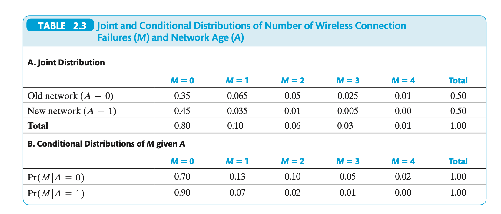

layout: true

<div class="my-footer"></div> 

---

```{r setup, include = FALSE, warning = FALSE, message = FALSE}
options(htmltools.dir.version = FALSE)
knitr::opts_chunk$set(
  message = FALSE,
  warning = FALSE,
  dev = "svg",
  cache = TRUE,
  fig.align = "center"
  #fig.width = 11,
  #fig.height = 5
)

# Load packages
library(tidyverse)
library(pander)
library(ggthemes)
library(gapminder)
library(countdown)
library(xaringanExtra)

# countdown style
countdown(
  color_border              = "#d90502",
  color_text                = "black",
  color_running_background  = "#d90502",
  color_running_text        = "white",
  color_finished_background = "white",
  color_finished_text       = "#d90502",
  color_finished_border     = "#d90502"
)
```


# Probability

This set of slides covers concepts from Stock and Watson chapter 2.


---

# Probabilities

*Probability* is a function that assigns a value in $[0,1]$ to a *set* (representing *events*).

Consider a fair 6-sided dice. 🎲

* Outcome space: $\Omega = \{1,2,3,4,5,6\}$
* Event: a partition of $\Omega$.

--

For example, the events A ("the outcome is even") and B ("the outcome is odd") are:

$$\begin{align}
A &= \{2,4,6\},\\
B &= \{1,3,5\}.
\end{align}$$

Having a *fair* dice means that

$$\Pr(1) = \dots = \Pr(6) = \frac{1}{6}$$

---

class: inverse

# Task 1: Probabilities

Given a fair 6-sided dice 🎲, i.e. an outcome space $\Omega = \{1,2,3,4,5,6\}$
and events

$$\begin{align}
A &= \{2,4,6\},\\
B &= \{1,3,5\}.
\end{align}$$

how does one determine the ***likelihood*** (or the **probability**) of event A occuring?


---

# Discrete Random Variables

A *Discrete Random Variable* is a function mapping outcomes to measurements.

For example, we might call

* $X$ the number we obtain from throwing the dice once.

* $X_1,X_2$ the 2 numbers we obtain from throwing the dice two times. 

* $D$ an indicator (either `0`, `1`) for whether a randomly sampled person answers "yes" or "no" when asked whether they have children. 


---
class: inverse

# Gambler's Ruin

The dealer tosses a fair coin. If it comes up tails (`T`) you win, if it's heads (`H`)you loose. 

Suppose we've seen the following sequence of tosses so far:

```
outcome:  H   H   H   H   H   H   H   H   H   H   ?
toss num: 1.  2.  3.  4.  5.  6.  7.  8.  9.  10. 11.  
```

You have lost 10 times in a row now. Does this increase the probability that you will win the next round? 

--

Which sequence is more likely to occur?

1. `TTTTTTTTTT` (10 `T` in a row)?
2. `HTHTTHTHHT` (random occurence of `T` and `H`)


---

## Gambler's Ruin

The probability of hitting 11 `H` in a row is

$$
\Pr(\text{11 Heads in a Row}) = \frac{1}{2^{11}} = 0.00048 = 0.05\%
$$
--

Ok, but I already had 10 `H`! What's the next toss likely going to be given that miserable history?

$$
\Pr(\text{toss 11 is Heads} | 10 \text{ Heads before})
$$
Let's calculate that probability on the board!


---

class: inverse

# Task 2: 2 Dice

Given two fair 6-sided dice 🎲 🎲, what is the probability of obtaining *at least* once the face "5"?

---

layout: false
class: title-slide-section-red, middle

# Probability Distributions

---

layout: true

<div class="my-footer"></div> 

---

## PDF/PMF and CDF of discrete RVs

* PDF/PMF: Probability Density/Mass Function. Table listing each outcome and the associated probability of observing it.
* CDF: Cumulative Distribution Function. Probability that a given RV takes on a value *less than or equal a certain value* (requires a notion of *ordering* - e.g. what about a dice with 6 different **colors**?)

### For our 6-sided fair dice

```{r,echo = FALSE}
num_pdf = data.frame(outcome = 1:6, pdf= 1/6, cdf = cumsum(rep(1/6,6)))
text_pdf = data.frame(outcome = 1:6, pdf= "1/6", cdf = paste0(1:6,"/6"))
text_pdf
```

---

## PDF/PMF and CDF of discrete RVs

* PDF/PMF: Probability Density/Mass Function. Table listing each outcome and the associated probability of observing it.
* CDF: Cumulative Distribution Function. Probability that a given RV takes on a value *less than or equal a certain value* (requires a notion of *ordering* - e.g. what about a dice with 6 different **colors**?)

### For our 6-sided fair dice

.pull-left[

```{r,echo = FALSE,fig.height=4}
plot(num_pdf$pdf,
     xlab = "Outcomes",
     ylab="Probability",
     pch=20) 
```
]

.pull-right[
```{r,echo = FALSE,fig.height=4}
plot(num_pdf$cdf,
     xlab = "Outcomes",
     ylab="Cumulative Probability",
     pch=20) 
```
]


---

## PDF/PMF and CDF of discrete RVs

* PDF/PMF: Probability Density/Mass Function. Table listing each outcome and the associated probability of observing it.
* CDF: Cumulative Distribution Function. Probability that a given RV takes on a value *less than or equal a certain value* (requires a notion of *ordering* - e.g. what about a dice with 6 different **colors**?)

### For our fair coin

```{r,echo = FALSE}
coin_pdf = data.frame(outcome = c(0,1), pdf= 1/2, cdf = cumsum(rep(1/2,2)))
ctext_pdf = data.frame(outcome = c("H(0)","T(1)"), pdf= "1/2", cdf = paste0(1:2,"/2"))
ctext_pdf
```

---


## PDF/PMF and CDF of discrete RVs

* PDF/PMF: Probability Density/Mass Function. Table listing each outcome and the associated probability of observing it.
* CDF: Cumulative Distribution Function. Probability that a given RV takes on a value *less than or equal a certain value* (requires a notion of *ordering* - e.g. what about a dice with 6 different **colors**?)

### For our fair coin

.pull-left[

```{r,echo = FALSE,fig.height=4}
plot(coin_pdf$outcome,
     coin_pdf$pdf,
     xlab = "Outcomes",
     ylab="Probability",
     pch=20,xaxt = "n") 
axis(1, at = c(0,1))
```
]

.pull-right[
```{r,echo = FALSE,fig.height=4}
plot(coin_pdf$outcome,coin_pdf$cdf,
     xlab = "Outcomes",
     ylab="Cumulative Probability",
     pch=20,xaxt = "n") 
axis(1, at = c(0,1)) 
```
]


---

## Bernoulli Distribution

* A special discrete RV with 2 outcomes: `0` and `1`, where event `1` ("success") occurs with probability $p$.

For example:

* Tomorrow it will rain with probability $p$ (it will *not* rain with $1-p$).

--

What kind of RV is flipping a *fair* coin? What about an *unfair* coin?

---

## PDFs and CDFs of continuous Variables

* slightly more complicated because we need calculus and integration.
* The basic idea is the same!

---

layout: false
class: title-slide-section-red, middle

# Expected Value and Variance

---

layout: true

<div class="my-footer"></div> 


---

## Expected Value and Variance

We write

$$E(Y) = y_1 p_1 + \dots + y_n p_n$$

For example for our dice example, where $X$ is the result of throwing the dice: 


$$\begin{align}
E(X) &= 1 \times \Pr(1) + 2 \times \Pr(2) + \dots + 6 \times \Pr(6) \\
     &=
\end{align}$$


**Everybody calculate this result now!**

---

# Expected Value and Variance

We write

$$
E(Y) = y_1 p_1 + \dots + y_n p_n
$$

```{r, echo = FALSE}
x = 1:6
pr = 1/6
EX = sum(x * pr)
```

For example for our dice example, where $X$ is the result of throwing the dice: 

$$\begin{align}
E(X) &= 1 \times \Pr(1) + 2 \times \Pr(2) + \dots + 6 \times \Pr(6) \\
     &= 1 \times \frac{1}{6} + 2 \times \frac{1}{6} + \dots + 6 \times \frac{1}{6} \\
     &= `r EX` \\
\end{align}$$

* So: We need to know ***all*** weights and values ($\Pr$ and $X$) in order to compute this quantity.


---

# $E(X)$ is a Theoretical Concept. Mission Impossible?

* Imagine you get this message:

--

1. Your mission, should you choose to accept it, is to inspect this device : 🔮. Whenever you touch it, it displays a number in $\{1,\dots,10\}$. E.g. `4,8,4,9,1,5,10,9,1`...kind of random.
2. We must know the long-run average, i.e. E(🔮). Or something terrible will happen!
3. This message will destroy itself in 10,9,8,...💣

--

* You **don't know** the theoretical distribution of all the numbers in 🔮 (the $\Pr$'s). Time is running ⏰

--

* What could you do? 🤔


---

<iframe src="https://giphy.com/embed/plVdDRfj5WV47sIAsh" width="960" height="538" style="" frameBorder="0" class="giphy-embed" allowFullScreen></iframe>

---

# $E(X)$ is a Theoretical Concept. Mission Impossible?


* If we had a huge number of observations from 🔮 (a *sample*), we could come up with a *guess* of E(🔮), based on the data we got. Empirical, like.

```{r}
set.seed(12345)  # to ensure reproducibility
Ps = runif(10)
Ps[c(2,3)] = 0
Ps = Ps / sum(Ps) # generate random weights
x = sample(1:10, size = 10000, replace = TRUE, prob = Ps)
xbar = mean(x)
xbar
```

--

* `xbar` = $\bar{x} = \frac{1}{N} \sum_i^{N} x_i$ is called *Sample Mean*, *Arithmetic Average*, *Sample Average*
* $\bar{x}$ is an ***estimator*** for $E(X) = \mu_X$. ($E(X) = \mu_X$ by the way.)


---

# Central Tendency - Mean and Median


.pull-left[
`mean(x)`: the average of all values in `x`.
$$E(X) = \mu_X = \frac{1}{N}\sum_{i=1}^N x_i = \bar{x}$$

***The second equality 👆 is correct only if...???***

```{r}
x <- c(1,2,2,2,2,100)
mean(x)
mean(x) == sum(x) / length(x)
```
]

--

.pull-right[
`median`: the value $x_j$ below and above which 50% of the values in `x` lie. $m$ is the median if

$$\Pr(X \leq m) \geq 0.5 \text{ and } \Pr(X \geq m) \geq 0.5$$
    
The median is robust against *outliers*.

```{r}
median(x)
```
]

---

## Quick Review

1. EV of a bernoulli
2. Continuous RV

---

# Variance and Standard Deviation

* A measure of *spread* of a distribution.
* The definition of *variance* is

$$var(Y) = E[(Y-\mu_Y)^2]$$

if $Y$ is discrete,

$$var(Y) = \sum_{i=1}^N (y_i-\mu_Y)^2 \times p_i.$$

--

* There is an issue with scaling: we *square* deviations.

* The standard deviation scales back to units of the data:

$$\sigma_Y = \sqrt{var(Y)}$$


???

* why squared?
* because deviations of same magnitude but opposite sign cancel out
* mean([5,15])

also because want to "exaggerate" larger deviations

* could also take absolute value of deviations no?


---

## Variance

.pull-left[

Consider two `normal distributions` with equal mean at `0`:
]

--

.pull-right[
```{r,echo = FALSE,fig.height=4,message = FALSE,warning = FALSE}
ggplot(data = data.frame(x = c(-5, 5)), aes(x)) +
  stat_function(fun = dnorm, n = 101, args = list(mean = 0, sd = 1), aes(color = "1"), size = 2) +
  stat_function(fun = dnorm, n = 101, args = list(mean = 0, sd = 2), aes(color = "4"), size = 2) +
  ylab(NULL) +
  scale_y_continuous(breaks = NULL) +
  scale_color_manual("Variance:", values = c("#d90502","#DE9854")) +
  theme_bw() +
  theme(legend.position = c(0.02,0.98),
        legend.justification = c(0,1),
        text = element_text(size=20))
```

Compute with:
```{r,eval = FALSE}
var(x)
```
]

---

## Example of other Spread Measures

.pull-left[

```{r,fig.width=5, fig.height=3}
# % catholic in 47 french-speaking
# swiss cantons in 1888
plot(swiss$Catholic,rep(1,nrow(swiss)),pch = 3,
     cex = 2,xlab = "% Catholic",yaxt = "n",ylab = "") 
```
]

.pull-right[
How do the values in column `Catholic` *vary*?

| Measure            | `R`              | Result             |
|:---------:|:-------------------:|:---------------------:|
| Variance           | `var(swiss$Catholic)`   | `r round(var(swiss$Catholic),2)`   |
| Standard Deviation | `sd(swiss$Catholic)`    | `r round(sd(swiss$Catholic),2)`    |
| IQR                | `IQR(swiss$Catholic)`   | `r round(IQR(swiss$Catholic),2)`   |
| Minimum            | `min(swiss$Catholic)`   | `r round(min(swiss$Catholic),2)`   |
| Maximum            | `max(swiss$Catholic)`   | `r round(max(swiss$Catholic),2)`   |
| Range              | `range(swiss$Catholic)` | `r round(range(swiss$Catholic),2)` |

]

---

class: inverse

# Task 3: Computing Variance by hand

1. Compute the variance of our 6-sided dice!
2. compute the variance of $X \sim \text{Bernoulli}(p)$!
    Bonus question: what value of $p$ maximizes this variance?


---

layout: false
class: title-slide-section-red, middle

# Two Random Variables <br> $(X,Y)$, (🎲, 🎲), (🎲, 🪙), (🪙, 🪙)

---

layout: true

<div class="my-footer"></div> 


---

# Two Random Variables: Example


.pull-left[
```{r x-y-corr,echo=FALSE,message=FALSE,warning=FALSE}
library(mvtnorm)
set.seed(10)
cor = 0.9
sig = matrix(c(1,cor,cor,1),c(2,2))
ndat = data.frame(rmvnorm(n=300,sigma = sig))
x = ndat$X1
y = ndat$X2
par(pty="s")
plot(x ~ y, xlab="x",ylab="y",cex = 2, pch = 21, bg = "red",col = "black")
```
]

.pull-right[

* Here, $X$ and $Y$ are ***joint normally*** distributed.
* We would write $$(X, Y) \sim 
\mathcal{N}\biggl(
\begin{bmatrix}
\mu_X \\
\mu_Y
\end{bmatrix},
\,
\Sigma
\biggr)$$
 
where $\Sigma$ is a *matrix*

$$\begin{bmatrix}
\sigma_X^2 & \rho \, \sigma_X \sigma_Y \\
\rho \, \sigma_X \sigma_Y & \sigma_Y^2
\end{bmatrix}$$

]


Taking as example the data in this plot, the concepts *covariance* and *correlation* relate to the following type of question:


---

# Tabulating Data

`table(x)` is a useful function that counts the occurence of each unique value in `x`:
```{r}
# install.packages("dslabs") in order to use this command
data("gapminder",package = "dslabs")
table(gapminder$continent)
```

--

The same can be achieved using the `count` function (from `dplyr`)
```{r}
gapminder %>% count(continent)
```

---

# Tabulating Data


Given two variables, `table` produces a contingency table:
```{r}
gapminder_new <- gapminder %>%
  filter(year == 2015) %>%
  mutate(fertility_above_2 = (fertility > 2.1)) # dummy variable for fertility rate above replacement rate
```


```{r}
table(gapminder_new$fertility_above_2)
```

```{r}
table(gapminder_new$continent,gapminder_new$fertility_above_2)
```


---

# Cross-Tabulating Data: A joint distribution!

The probability that $X = x$ and $Y=y$ is

$$\Pr(X=x,Y=y)$$
.pull-left[
```{r}
# table with absolute numbers
abstab = table(gapminder_new$continent,
               gapminder_new$fertility_above_2)
(jd <- round(prop.table(abstab),2))  # proportions in each cell
```


* check: proper probability distribution?

```{r}
sum(jd)  # sums up all elements
```
]

--

.pull-right[

* for instance
$$\Pr(\text{Asia},\text{TRUE}) = 0.14673$$

* You can see 👀 that this is just the **share** of cases in each bin! 

]

---

# Tabulating Data: marginal distributions!


.pull-left[
```{r}
# proportions by row
(m1 = prop.table(abstab, margin = 1))
```

check?

```{r}
rowSums(m1)
```
]

--

.pull-right[
```{r}
# proportions by column
(m2 = prop.table(abstab, margin = 2))
```

check?

```{r}
colSums(m2)
```
]

---

# Joint Distributions

The probability that $X = x$ and $Y=y$ is

$$\Pr(X=x,Y=y)$$

```{r,echo = FALSE}
r = data.frame(x0 = c(0.15,0.15),x1 = c(0.07,0.63))
names(r) <- c("Rain (X=0)", "No Rain (X=1)")
rownames(r) <- c("Long Commute (Y=0)", "Short Commute (Y=1)")
r
```

for instance,

* $\Pr(Y = 1, X = 0) = 0.15$
---

# Marginal Distributions

$$\Pr(Y = y) = \sum_{i=1}^k \Pr(X=x_i, Y = y)$$

```{r,echo = FALSE}
r
```

* Probability of long commute, *irrespective of rain*, is 0.15 + 0.07 = 0.22

* Probability of rain, *irrespective of length of commute*, is 0.15 + 0.15 = 0.3


---

class: inverse

# Task 4 : Computing Marginal Distributions

`r countdown(minutes = 5, top = 0)`

.pull-left[
```{r}
r
```
]

.pull-right[
1. Compute the marginal distribution of $X$
1. Compute the marginal distribution of $Y$
]


---

# Conditional distributions


* Conditional distribution is $\Pr(X=x|Y=y) = \frac{\Pr(X=x,Y=y)}{\Pr(Y=y)}$

* We **fix** the value of one variable, and look at the resulting distribution of the other variable.

* Notice, the result must be a *valid* probability distribution, i.e., it must sum to 1.

* We compute the probability as before, but restrict attention to where the condition we impose is true.

---

class: inverse

# Task 5: compute conditional distribution

`r countdown(minutes = 3, top = 0)`


Consider 

```{r,echo = FALSE}
r
```

* Suppose we know that it does not rain $x = 1$. What is the distribution of $Y$, *given* this knowledge, i.e. what is the distribution $\Pr(Y|X=1)$ ?


---

class: inverse

# Task 6: Computing More Conditional Distributions

`r countdown(minutes = 5, top = 0)`

.pull-left[
```{r}
jd
```
]

.pull-right[
1. Compute the Distribution of countries conditional on low fertility?
2. Compute the Distribution of countries conditional on being in Asia?
3. Compute the marginal distribution of high/low fertility
]


---

# Conditional Expectation

We define

$$E(Y|X = x) = \sum_{i=1}^k y_i \Pr(Y = y_i|X=x)$$

* Notice the $y_i$ there!

* Basically this is expected value of $Y$, but **under the assumption that** $X$ takes on the value $x$.

* We *fix* the joint distribution of $(Y,X)$ at a certain value $X=x$.


---

class: inverse

# Task 7: Conditional Expectation



1. Compute $E(M)$

2. Compute $E(M|A = 0)$


---

# Law of Iterated Expectations

* We can decompose the expected value of $Y$ into subgroups, see what fraction of total probability each group makes up, and compute their weighted average.

--

```{r echo = FALSE}
df = data.frame(name = c("Peter","James", "Mary","John","Amy"), sex = c("M","M","F","M","F"), height = c(1.9,1.75,1.68,1.86,1.59))
df

```
* The average height here is $(1.9 + 1.75 + 1.68 + 1.86 + 1.59) / 5 = `r mean(df$height)`$: 

---

# Law of Iterated Expectations


> The average height here is `r mean(df$height)`

* What is the average for each **group** by sex?

```{r,echo = FALSE}
df %>% group_by(sex) %>% summarise(n = n(), mean_height = mean(height))
```

--

* Can we recover the unconditional mean from this information? Yes we can!

* We need again *weights* and *values*, like for the standard $E(Y)$

```{r}
weights = c(2/5, 3/5)
values = c(1.635, 1.836667)
sum(weights * values) # 2/5 * 1.635 + 3/5 * 1.836667

```

---

# Law of Iterated Expectations


* What did we just do?

* We established that we can get the unconditional mean of $Y$ from the *conditional* one, if we know the *weights* we have to give to each subgroup. More precisely:

.pull-left[
1. We know $E(Y|X)$:
    1. $E(Y|\text{male})= 1.836667$
    2. $E(Y|\text{female})= 1.635$
    
2. We know the proportion of both groups:
    1. $\Pr(\text{male})= 3/5$
    2. $\Pr(\text{female})= 2/5$

]
    
.pull-right[

Therefore, we can recompose $E(Y)$:

$$\begin{align}
E(Y) &= \sum_{i=1}^k E(Y|X = x_i) \Pr(X = x_i)\\
     &= E_X\left[  E(Y|X) \right]
\end{align}$$

]

---

# Law of Iterated Expectations

* One particular version of this comes up often in econometrics:

$$E[Y|X] = 0 \Rightarrow E[Y] = 0$$

* Why? Well, now you know that $E[Y|X] = 0$ for all possible $X$ is zero.

* Compute $E(Y) = \sum_{i=1}^k 0 \times \Pr(X = x_i)$!

---

# Independence

* We call 2 RVs *independent* if knowing the value of one of them is not informative about the value of the other.


* The precise definition of this statement is $$\Pr(X=x | Y = y) = \Pr(X=x) \Pr(Y=y)$$ 

--


* or: $$\Pr(X=x , Y = y) = \Pr(X=x) \Pr(Y=y)$$ 


---

# Covariance

* Covariance tells us how two RVs co-vary. 

$$\begin{align}
cov(X,Y) = \sigma_{XY} &= E\left[ (X - \mu_X) (Y- \mu_Y) \right] \\
                       &= \sum_{i=1}^k \sum_{j=1}^m (x_i - \mu_X) (y_j- \mu_Y) \Pr(X = x_i, Y = y_j)
\end{align}$$

* Notice how this object tells us how large deviations of $X$ from its mean *jointly* occur with such deviations of $Y$.

* This confounds the scale of $X$ and $Y$, however, so not easy to interpret

---

# Correlation


---

# Correlation and Conditional Mean


---

# Random Sampling

* KC 2.5

* i.i.d

* 


---

# Sampling Distribution of Sample Average


---

# Mean and Variance of Sample Average

# How are x and y related? Covariance and Correlation

---

# Covariance

* The covariance is a measure of __joint variability__ of two variables.
    $$Cov(x,y) = \frac{1}{N} \sum_{i=1}^N(x_i-\bar{x})(y_i-\bar{y})$$

--

* The `cov` function computes the covariance:

```{r}
cov(gapminder_new$fertility,gapminder_new$infant_mortality, use = "complete.obs")
```

--

* Difficult to interpret because sensitive to the variables' dispersions from the mean

---

# Correlation

* The correlation is a measure of the strength of the __linear association__ between two variables.
    $$Cor(x,y) = \frac{Cov(x,y)}{\sqrt{Var(x)}\sqrt{Var(y)}}$$

--

* The `cor` function computes the correlation:

```{r}
cor(gapminder_new$fertility,gapminder_new$infant_mortality, use = "complete.obs")
```

---

# Correlation

* **Correlation is always between -1 and 1!**

[mathisfun](https://www.mathsisfun.com/data/correlation.html)*

---

class: inverse

# Task 4: Summarising data

`r countdown(minutes = 10, top = 0)`

1. Compute the mean of GDP in 2011 and assign to object `mean`. You should exclude missing values. (*Hint: read the help for `mean` to remove `NA`s*).

1. Compute the median of GDP in 2011 and assign to object `median`. Again, you should exclude missing values. Is it greater or smaller than the average?

1. Create a density plot of GDP in 2011 using `geom_density`. A density plot is a way of representing the distribution of a numeric variable. Add the following code to your plot to show the median and mean as vertical lines. What do you observe?
`geom_vline(xintercept = as.numeric(mean), colour = "red") +` <br>
    `geom_vline(xintercept = as.numeric(median), colour = "orange")`

1. Compute the correlation between fertility and infant mortality in 2015. To drop `NA`s in either variable set the argument `use` to "pairwise.complete.obs" in your `cor()` function. Is this correlation consistent with the graph you produced in Task 3?


---

class: title-slide-final, middle
background-image: url(../img/logo/esomas.png)
background-size: 250px
background-position: 9% 19%

# That's all for Probability!


|                                                                                                            |                                   |
| :--------------------------------------------------------------------------------------------------------- | :-------------------------------- |
| <a href="https://github.com/floswald/Econometrics-Slides">.ScPored[<i class="fa fa-link fa-fw"></i>] | Slides |
| <a href="https://floswald.github.io">.ScPored[<i class="fa fa-link fa-fw"></i>] | My Homepage |
| <a href="https://scpoecon.github.io/ScPoEconometrics/">.ScPored[<i class="fa fa-github fa-fw"></i>]                          | Book                       |

```{r makepdf, echo=FALSE,eval=FALSE}
system("decktape chapter1.html chapter1.pdf --chrome-arg=--disable-web-security")
```
